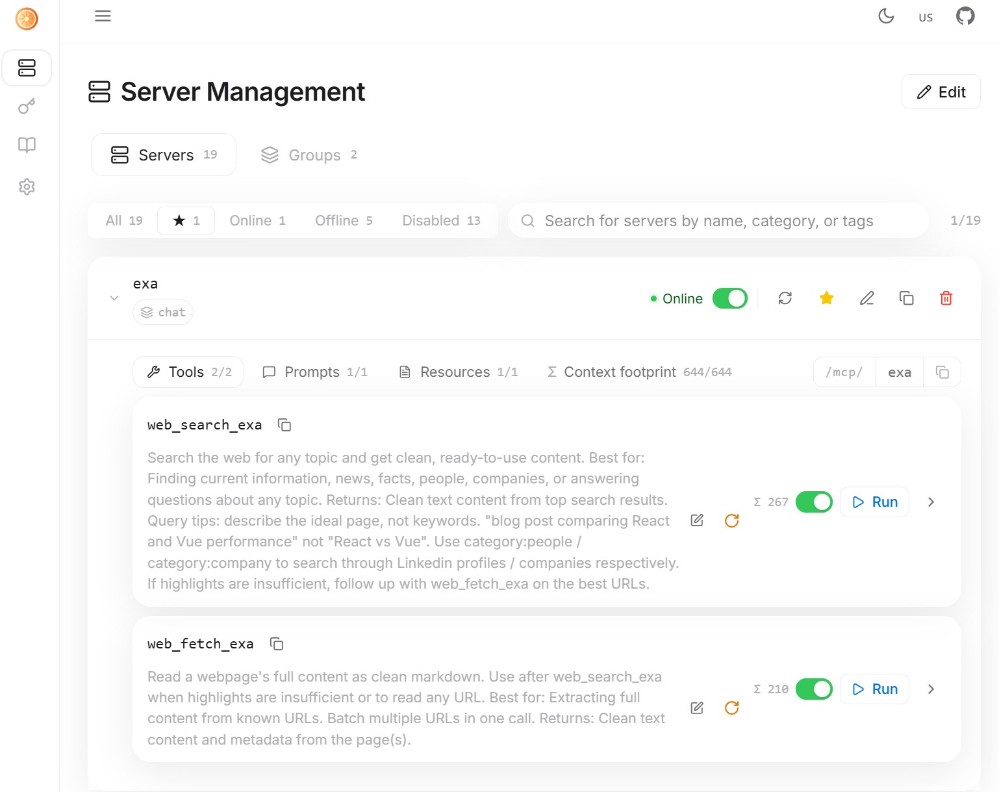
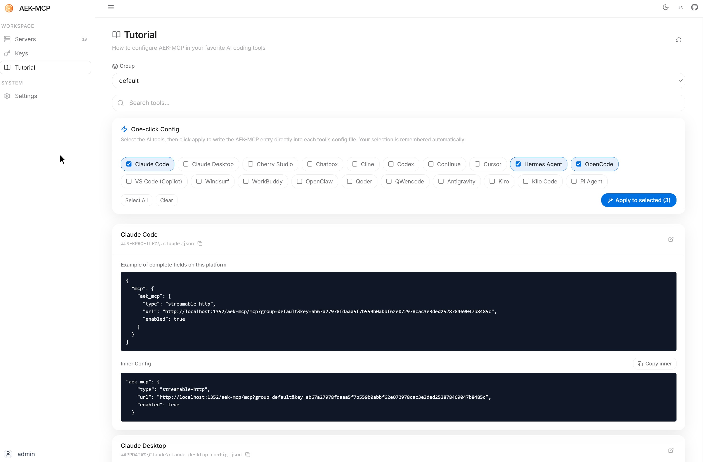

<div align="center">


<a name="readme-top"></a>

# Agent Enhance Kit (AEK)

AI Agent productivity toolkit

[![Go version][go_version_img]][go_dev_url]
[![Go report][go_report_img]][go_report_url]
[![License][repo_license_img]][repo_license_url]

**&searr;&nbsp;&nbsp;Other languages&nbsp;&nbsp;&swarr;**

[简体中文](README-ZH.md)

</div>

Agent Enhance Kit is a **monorepo**

| Package | Description |
|---------|-------------|
| [`aek-websearch`](packages/aek-websearch) | Multi-provider web search engine: CLI + HTTP API + MCP Server |
| [`aek-mcp`](packages/aek-mcp) | MCP proxy gateway + Web management UI (Next.js frontend + Go backend) |

## 🚀 Quick Start

1. [Fork](https://github.com/cheezmil/agent-enhance-kit/fork) this repo on GitHub (Convenient for you to submit PR, improve this project in a timely manner, thank you for using)
2. Clone your fork:

   ```bash
   git clone https://github.com/<YOUR_USERNAME>/agent-enhance-kit.git
   ```
3. Open the project in your AI coding agent (Cursor, Claude Code, Hermes, etc.)
4. Ask the agent:
   ```plaintext
   What is this project? How do I use it? Help me install and use it.
   ```
   The agent will handle the rest.

---

### 🔍 aek-websearch

Multi-provider search aggregation with a unified interface and automatic failover.

Supported search providers:
`Exa` · `Tavily` · `Serper` · `DuckDuckGo` · `Yahoo` · `You.com` · `Linkup` · `Wolfram Alpha` · `Context7`

#### Search provider signup

Providers with free tiers (API Key required):

| Provider | Free quota | Credit card | Signup URL | Notes |
|----------|-----------|-------------|-----------|-------|
| Tavily | 1k/month | No | https://app.tavily.com/home | Ready to use after signup, no credit card |
| Exa | 1k/month | No | https://exa.ai/pricing | Get API Key from Dashboard after signup |
| Serper | 2.5k one-time | No | https://serper.dev/signup | Ready to use after signup, no credit card |
| You.com | $100 one-time | No | https://you.com/platform | $100 credit on signup |
| Linkup | $20/month (≈4k queries) | No | https://www.linkup.so/ | $20 credit on signup, refreshed monthly |
| Parallel | Anonymous free | No | https://platform.parallel.ai | Works anonymously, higher limits after signup |
| WolframAlpha | 2k/month | No | https://developer.wolframalpha.com/ | Requires Wolfram ID, get APP_ID |

#### Search provider ranking

Based on actual usage testing (as of 2026-08-21):

**Exa** > **Serper** > **Tavily** > Others

> If you want to save time, just use **Exa** directly — it delivers the best overall search quality and experience.

*This ranking reflects personal testing experience and is subject to change over time.*

 ### 🔌 aek-mcp

MCP proxy gateway for centralized management of all MCP server connections.

- **Transports**: stdio / HTTP / SSE
- **Web management UI**: Server management, user management, group management, API keys, activity logs, prompts, resources
- **Permissions**: User → group → tool-level granular access control

**Server management dashboard** — Manage all connected MCP servers, filter by status (Online / Offline / Disabled), and inspect each server's Tools, Prompts, Resources and context footprint.



**Config generator** — Auto-generate and copy-ready MCP configurations for various AI tools (e.g. Claude Code), supporting both full and inner JSON snippets.



---

<!-- Links -->

[go_version_img]: https://img.shields.io/badge/Go-1.26+-00ADD8?style=for-the-badge&logo=go
[go_dev_url]: https://pkg.go.dev/github.com/cheezmil/agent-enhance-kit
[go_report_img]: https://img.shields.io/badge/Go_report-A+-success?style=for-the-badge&logo=none
[go_report_url]: https://goreportcard.com/report/github.com/cheezmil/agent-enhance-kit
[repo_license_url]: https://github.com/cheezmil/agent-enhance-kit/blob/main/LICENSE
[repo_license_img]: https://img.shields.io/badge/license-MIT-green?style=for-the-badge&logo=none
[github_img]: https://img.shields.io/badge/github-181717?style=for-the-badge&logo=github
[github_url]: https://github.com/cheezmil/agent-enhance-kit